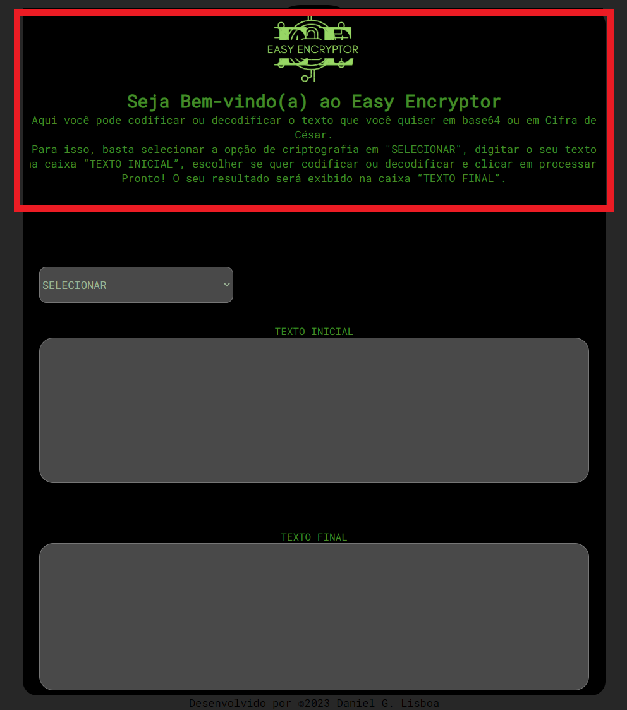
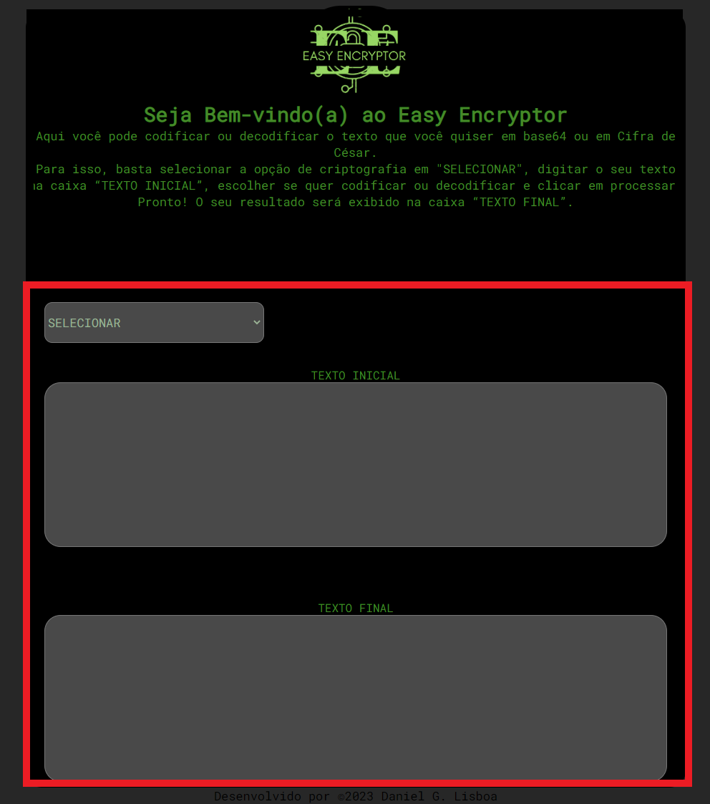
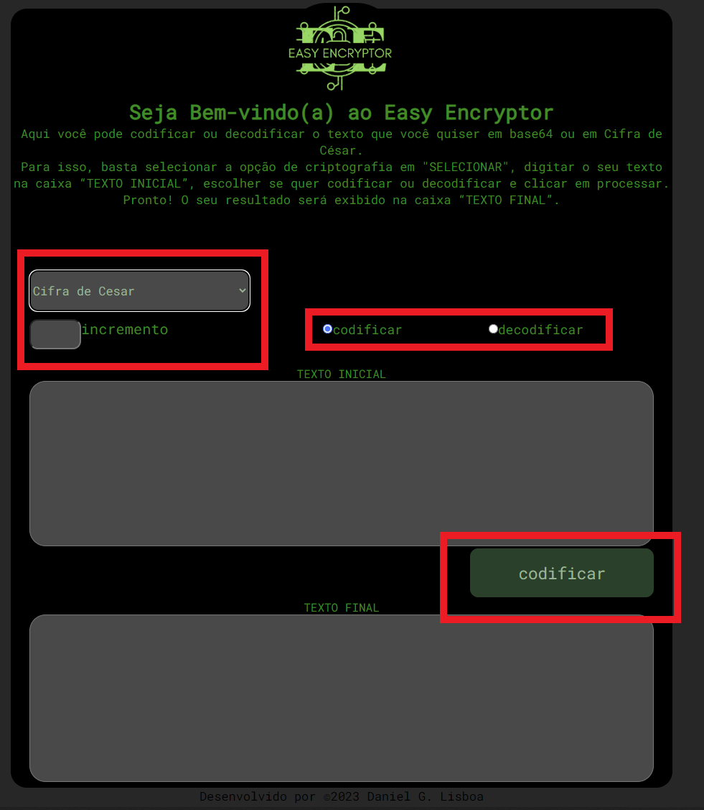

# projeto-individual-M2

Desenvolvido por Daniel Guerra Lisboa.

Esta Aplicação é responsável por capturar o conteúdo digitado pelo usuário e codificar ou decodificar utilizando as criptografias Cifra de César e Base64.

- No topo da página temos a logo e um texto de auxílio ao usuário.

- No conteúdo principal temos o campo "SELECIONAR" e os campos "TEXTO INICIAL" e "TEXTO FINAL".

- Ao selecionar uma das opções em "SELECIONAR" são habilitados os radio-buttons "codificar" e "decodificar" além do botão de processamento.
- Obs.: Ao escolher a opção Cifra de César também é habilitado o campo "Incremento".

Para utilização correta da página o usuário deve seguir os seguintes passos:
- PARA CIFRA DE CÉSAR:
1. Selecionar a opção de criptografia em "SELECIONAR";
2. Informar o incremento da cifra no campo "INCREMENTO";
3. Escolher se quer CODIFICAR ou DECODIFICAR;
4. Digitar o seu texto na caixa “TEXTO INICIAL”;
5. Clicar no botão de processamento que receberá o nome da opção escolhida no passo anterior(codificar ou decodificar);
6. Pronto! O seu resultado será exibido na caixa “TEXTO FINAL”

- PARA BASE 64:
1. Selecionar a opção de criptografia em "SELECIONAR";
2. Escolher se quer CODIFICAR ou DECODIFICAR;
3. Digitar o seu texto na caixa “TEXTO INICIAL”;
4. Clicar no botão de processamento que receberá o nome da opção escolhida no passo anterior(codificar ou decodificar);
5. Pronto! O seu resultado será exibido na caixa “TEXTO FINAL”

